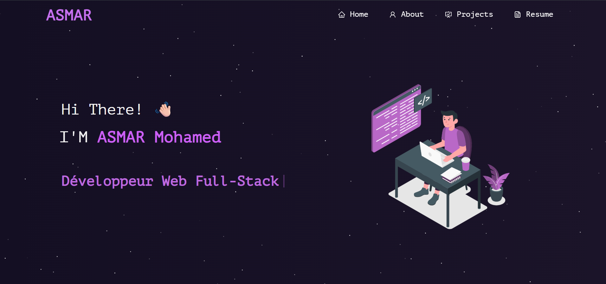

<h2 align="center">
  Portfolio Website - v2.0<br/>
  <a href="#" target="_blank">My Portfolio</a>
</h2>

<div align="center">
  
</div>

<br/>

<div align="center">

[](https://forthebadge.com) &nbsp;
[](https://forthebadge.com) &nbsp;
[](https://forthebadge.com) &nbsp;
 &nbsp;


</div>

<h3 align="center">
    🔹
    <a href="https://github.com/asmar-mohamed/Portfolio/issues">Report Bug</a> &nbsp; &nbsp;
    🔹
    <a href="https://github.com/asmar-mohamed/Portfolio/issues">Request Feature</a>
</h3>

## TL;DR

You can fork this repository to customize it and make it your own.  
Please give credit by linking back to my GitHub: [asmar-mohamed](https://github.com/asmar-mohamed).

---

## Built With

This portfolio project showcases my personal projects, skills, and resume.<br/>
It was built with the following technologies:

- **React v17**  
- **React Router v6**  
- **Bootstrap v5 & React-Bootstrap**  
- **CSS3**  
- **JavaScript (ES6+)**  
- **VS Code**  
- **Vercel** (for deployment)

---

## Features

- **📖 Multi-Page Layout**: Home, About, Projects, Resume  
- **🎨 Styled with Bootstrap & Custom CSS**: Easy to customize colors and layout  
- **📱 Fully Responsive**: Works on mobile, tablet, and desktop  
- **✨ Cool Effects**: Particle background & Typewriter effect on Home page  

---

## Getting Started

Clone this repository. You will need **Node.js** and **Git** installed globally.

```bash
git clone https://github.com/asmar-mohamed/Portfolio.git
cd Portfolio
npm install
npm start
